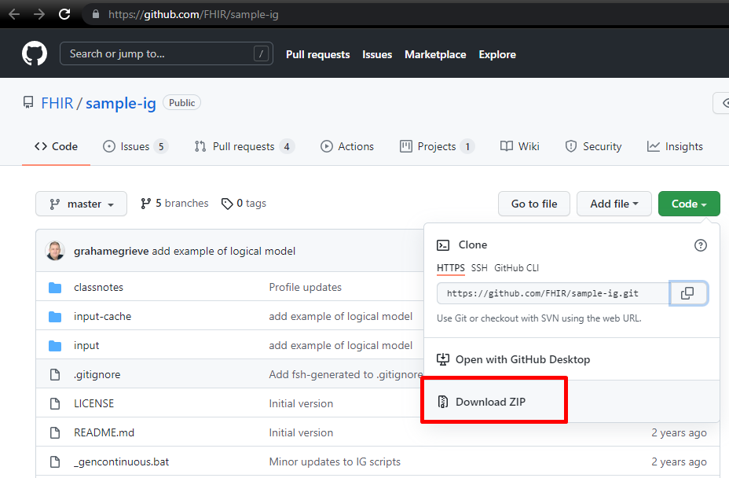

# Baixando projeto do GIT

O ambiente inicial para realizar iniciar a construção de perfis (perfilização) no ambiente para o <mark style="color:yellow;">****</mark>** Guia de Implementação**, será necessário fazer o download do source no repositório GitHub Oficial do FHIR ou através do repositório disponibilizado no **I Curso On-line HL7 FHIR para RNDS.** Consulte a tabela inicial e pegue o link [Tabela de Referência](../leia-primeiro.md)


**For dummies:** Para realizar o download a partir de um repositório do GIT, é possível através do GIT, fazendo um **CLONE** do repositório, mas também é possível realizar o download do repositório **.ZIP** a partir do repositório diretamente.


### Clonando repositório no GIT:

Crie uma pasta onde deseja colocar o conteúdo do projeto, e entre nesta pasta.&#x20;

![Pasta vazia criada com nome \[projetoFHIR\].](<../../.gitbook/assets/image (10).png>)


Lembre de não criar nomes de pastas com \[espaços] no nome, pode causar erros ao executar o Guia.


Em seguida, clique com o botão direito do mouse na pasta vazia, e selecione o GIT BASH para abrir a janela interativa.&#x20;

![Deve ser a segunda opção \[Git Bash Here\] e abrirá o terminal interativo. A primeira opção é uma interface GUI e pode dificultar.](<../../.gitbook/assets/image (13).png>)

A tela do Git BASH para windows é parecida com a seguir:

.png>)

O próximo passo é realizar o CLONE do projeto no repositório OFICIAL FHIR. Na página do repositório, abra o&#x20;

.

.png>)

Copie a URL do projeto e faça o download na sua pasta criada, utilizando o comando **GIT CLONE**. Logo depois a pasta do projeto será baixada para o diretório.

.png>)

### Baixando os arquivos do projeto como .ZIP

### &#x20;

E após descompactar o projeto na pasta.&#x20;


Ambas as formas de download deverão resultar na estrutura de pastas a seguir.


.png>)

